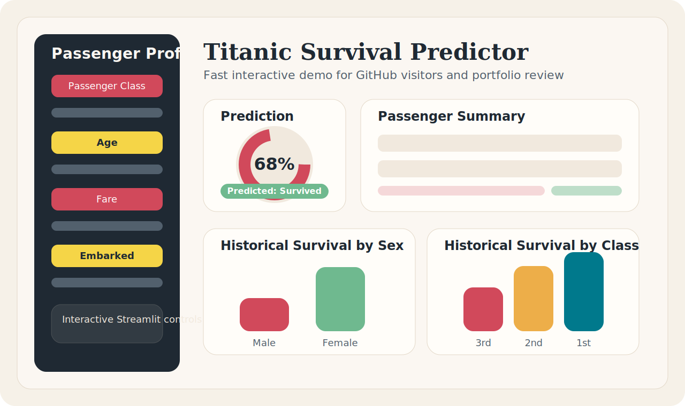
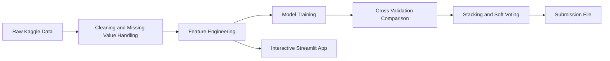

# Titanic Survival Prediction..


[](https://www.python.org/)
[](https://streamlit.io/)
[](https://scikit-learn.org/)
[](https://www.kaggle.com/competitions/titanic)
[](https://titanic-prediction-euncq4cfjurw2bwuvbe8im.streamlit.app/)

An end-to-end Titanic survival prediction project that combines feature engineering, model tuning, ensembling, and a live interactive prediction app.



Live app: https://titanic-prediction-euncq4cfjurw2bwuvbe8im.streamlit.app/

## Why This Repo Stands Out

- moves beyond a single notebook by including a runnable web app
- uses engineered family and passenger features, not only raw columns
- compares multiple models and ensemble strategies
- is easier to explore, reuse, and present as a portfolio project

## Project Snapshot

| Area | Details |
|---|---|
| Problem | Predict whether a passenger survived the Titanic disaster |
| Dataset | Kaggle Titanic `train.csv` and `test.csv` |
| Main Workflow | EDA, feature engineering, tuning, model comparison, ensemble selection |
| Notebook | `Titanic_Prediction.ipynb` |
| Interactive Demo | `app.py` with Streamlit |

## Pipeline



## What The Notebook Does

- loads and inspects the Titanic training and test data
- creates leave-one-out survival features based on ticket groups and last names
- engineers features such as title, family size, deck, and categorical encodings
- tunes XGBoost and LightGBM with Optuna
- compares multiple models with 10-fold stratified cross-validation
- builds stacking and soft-voting ensembles
- exports the final `submission.csv`

## Models Used

- XGBoost
- LightGBM
- Random Forest
- Extra Trees
- HistGradientBoosting
- Support Vector Classifier
- Logistic Regression as a stacking meta-learner

## Interactive App

The Streamlit app lets a user enter passenger details and instantly see:

- predicted survival probability
- final survival class
- feature summary for the entered passenger
- dataset context such as class distribution and average survival rate

Run it locally:

```bash
pip install -r requirements.txt
streamlit run app.py
```

## GitHub Display

This repository is set up to look good directly on GitHub:

- banner and app preview render inline in the README
- badges make the tech stack easy to scan
- Mermaid pipeline diagram explains the workflow visually
- the notebook remains viewable in the browser

For a fully live version of the app, deploy `app.py` on Streamlit Community Cloud and place the public link near the top of this README.
The current live deployment is available here:
https://titanic-prediction-euncq4cfjurw2bwuvbe8im.streamlit.app/

## Repository Structure

```text
.
|-- app.py
|-- Titanic_Prediction.ipynb
|-- train.csv
|-- test.csv
|-- submission.csv
|-- gender_submission.csv
|-- requirements.txt
|-- README.md
|-- LICENSE
`-- .streamlit/
    `-- config.toml
```

## Quick Start

1. Create a virtual environment.
2. Install dependencies:

```bash
pip install -r requirements.txt
```

3. Launch the notebook for the full training workflow:

```bash
jupyter notebook Titanic_Prediction.ipynb
```

4. Or launch the interactive app:

```bash
streamlit run app.py
```

## Core Features

- title extraction from passenger names
- family size and isolation indicators
- fare and age imputation
- categorical encoding for sex, embarkation, and class-aware inputs
- model comparison and ensemble-based final prediction

## Ideas For Further Improvement

- add screenshots or a short demo GIF in an `assets/` folder
- move notebook logic into reusable `src/` modules
- publish the Streamlit app online
- add automated tests for preprocessing and prediction logic
- track notebook and app performance metrics in the README

## Dataset Source

Kaggle Titanic competition:
https://www.kaggle.com/competitions/titanic

## Author

Shivam Pawaskar
